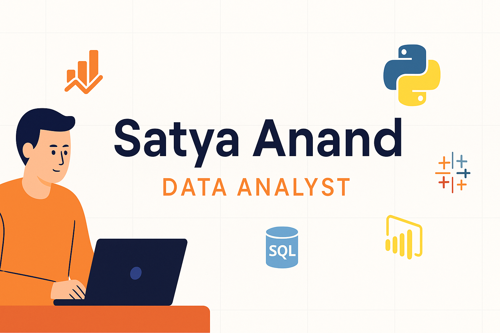

  

# 👋 Hi there, I'm Satya Anand

## 🎯 About Me
I'm an aspiring **Data Analyst** with a passion for solving real-world problems through data. I specialize in **data cleaning**, **analysis**, and **dashboarding** using tools like **SQL, Python, Power BI**, and **Tableau**. I enjoy uncovering actionable insights and presenting them through compelling visual stories.

🔍 I'm actively seeking opportunities in:
- Data Analytics
- Business Intelligence
- Reporting & Visualization

---

## 🛠️ Skills & Tools

**Languages & Libraries:**  
`Python` | `SQL` | `Pandas` | `NumPy` | `Matplotlib` | `Seaborn`

**BI & Visualization:**  
`Power BI` | `Tableau` | `Excel`

**Databases:**  
`MySQL` | `SQLite`

**Other Tools:**  
`Git` | `Jupyter Notebook` | `VS Code` | `Google Sheets` | `Canva` | `Figma`

---

## 📌 Featured Projects

### 🛒 [Retail Business Performance & Profitability Analysis](https://github.com/Satya-Anand/Retail-Business-Performance-Profitability-Analysis)
Analyzed Superstore retail data to uncover profit-draining categories and seasonal trends. Built dashboards in Power BI & Tableau for interactive storytelling.  
**Tools:** SQL, Python, Power BI, Tableau

---

### 🧮 [SQL Portfolio](https://github.com/Satya-Anand/SQL-Portfolio)
A curated collection of SQL scripts showcasing real-world scenarios: customer segmentation, profitability analysis, and KPI reports.  
**Tools:** MySQL, SQLite

---

### 🚢 [Titanic - ML with Kaggle](https://github.com/Satya-Anand/Titanic-ML-Kaggle)
Explored the Titanic dataset using EDA, feature engineering, and ML models like Logistic Regression and Random Forest.  
**Tools:** Python, Pandas, Scikit-learn

---

## 🏅 Certifications
✅ 30-Days Power BI Micro Course – Skill Course 

✅ Advance Data Analysis using Excel and Power BI – LetsUpgrade 

✅ Power BI Bootcamp – LetsUpgrade 

✅ Basics of Python – UniAthena 
---

## 📫 Contact Me
- 📧 Email: [satyaanand105@gmail.com](mailto:satyaanand105@gmail.com)  
- 💼 LinkedIn: [linkedin.com/in/satya-anand-14840b2b5](https://www.linkedin.com/in/satya-anand-14840b2b5)

---

### 🚀 Let’s Connect!
If you’re hiring or collaborating on anything related to data – I’d love to talk!  

<!-- Banner -->

  

<!-- Typing SVG -->

  

---

## 👋 About Me

I'm a passionate **Data Analyst** with strong experience in:
- **Data wrangling, visualization & storytelling**
- **BI reporting using Power BI & Tableau**
- **SQL query building and automation with Python**

📈 I love building insightful dashboards, exploring patterns in messy data, and optimizing business performance with analytics.

🚀 *Actively seeking roles in:*
**Data Analysis · Business Intelligence · Reporting Automation**

---

## 🛠️ Skills & Tools

---

## 🔥 Featured Projects

### 🛒 [Retail Business Profitability Analysis](https://github.com/Satya-Anand/Retail-Business-Performance-Profitability-Analysis)
> Tools: SQL · Python · Power BI · Tableau  
Analyzed sales data to discover low-profit segments and operational inefficiencies. Created dashboards to drive business strategy.

---

### 🧮 [SQL Portfolio](https://github.com/Satya-Anand/SQL-Portfolio)
> Tools: MySQL · SQLite  
A collection of real-world SQL queries on customer, sales, and profitability data — covering subqueries, joins, CTEs, and data cleaning.

---

### 🚢 [Titanic ML – Kaggle](https://github.com/Satya-Anand/Titanic-ML-Kaggle)
> Tools: Python · Scikit-learn  
Machine learning pipeline to predict passenger survival using logistic regression and decision trees. Scored ~80% on Kaggle.

---

## 📊 GitHub Stats

  
  

---

## 📚 Currently Learning
- 💡 Power BI DAX & row-level security
- 🧠 Intermediate Statistics for Analysts
- 🛠 SQL Window Functions & Performance Tuning
- 🤖 Python for automation

---

## 📫 Contact Me

- 💼 [LinkedIn](https://www.linkedin.com/in/satya-anand-14840b2b5)
- 📧 [satyaanand105@gmail.com](mailto:satyaanand105@gmail.com)

---

> ⭐ *If you like my work, feel free to connect or star a repo!*

